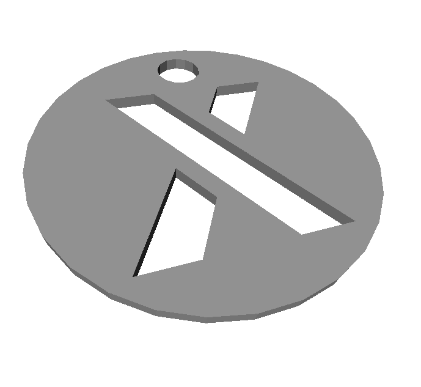
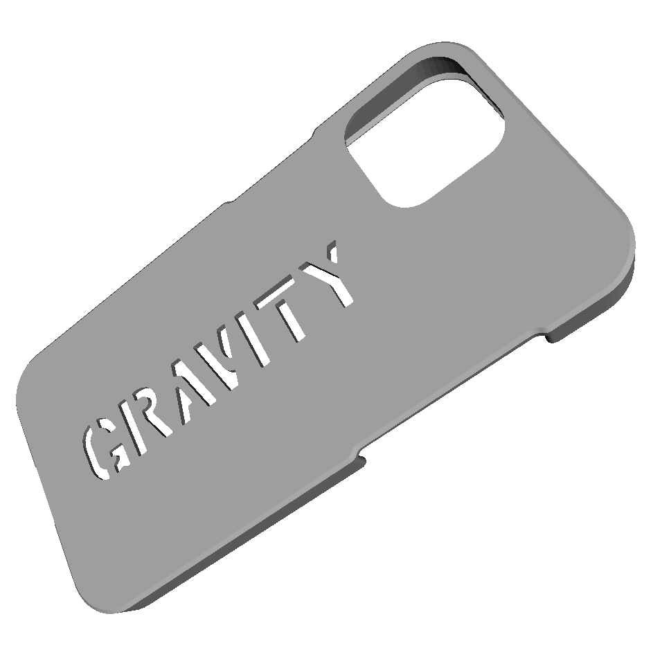

# 3D Model Generator
This project is about generating customized models for 3D printing. 
The *3D Model Generator* is based on [docker](https://www.docker.com/), [OpenSCAD](https://openscad.org/) 
and [python](https://www.python.org/). 
The built-in, parametric 3D models can easily be customized via json.

Head over to the release section to download pre-generated models. 
Read on if you want to create your own customized models.


## Model Package Releases
You can download the latest package  from the github release section. 
The package contains CAD model files which have to be processed with a slicer before 3D printing.


# Built-In Models

## Trolley Tokens
Trolley Tokens in various sizes. They can be used also as decoration for keyrings.
For customisation options, have a look at [example_token.json](config/example_token.json).

[Available also on prusaprinters.org](https://www.prusaprinters.org/prints/135899-trolley-tokens-i-got-them-all)




## Smartphone Cases
Smartphone cases for various brands. There are versions for TPU and PETG.
For customisation options, have a look at [example_smartphone_case.json](config/example_smartphone_case.json).




# Usage

## 3dgen Docker Image

The 3D model generator is released as a docker image on dockerhub: 
https://hub.docker.com/r/gravity981/3dgen


## Example 1
As soon as you have installed docker on your system it's as simple as that:

`docker run -v /path/to/dir:/work gravity981/3dgen`

Docker is going to fetch the image automatically from dockerhub if it is not already installed on your computer. 
Then it is going to launch a container, generate an example model and save it to the directory `/path/to/dir/`.

## Example 2

```
docker run -v $PWD:/work gravity981/3dgen \
  -c config/example_token.json \
  -o output/example_token \
  --thumbnails
```
This will mount the current working directory (`$PWD`) to the docker container to make it work with input/output files from there.
In this example the generated model file is saved to your current working directory under `output/example_token`.


The `example_token.json` file contains parameters which can be customized for the token model. 
Create your own copy of this file and pass it with the `-c` argument to the generator. 
Make sure it is located in the directory which is mounted to the docker container. 
> :information_source: Customizable parameters are specific to the selected model.

The option `--thumbnails` causes the generator to output an additionl picture (.png) of the model.


## Arguments
Optional Arguments can be passed to get more control over the generator output
```
usage: 3dgen [-h] [-m MODEL_DIR] [-c CONF_FILE] [-o OUTPUT_DIR]
             [-f OUTPUT_FORMAT] [-t] [-p]

Generate 3D Tokens

optional arguments:
  -h, --help            show this help message and exit
  -m MODEL_DIR, --model-dir MODEL_DIR
                        Path to models directory
  -c CONF_FILE, --conf-file CONF_FILE
                        Path to config file
  -o OUTPUT_DIR, --output-dir OUTPUT_DIR
                        Path to output directory
  -f OUTPUT_FORMAT, --output-format OUTPUT_FORMAT
                        Format of output files
  -t, --thumbnails      Create thumbnails too
  -p, --poster          Create poster with stitched thumbnails
```

# Contribute
If you want to add a token have a look at [all_tokens.json](config/all_tokens.json). Open a PR to extend this json file with the config you want to add.

If you want to add another model. Open a PR with an additional scad file and an example config
