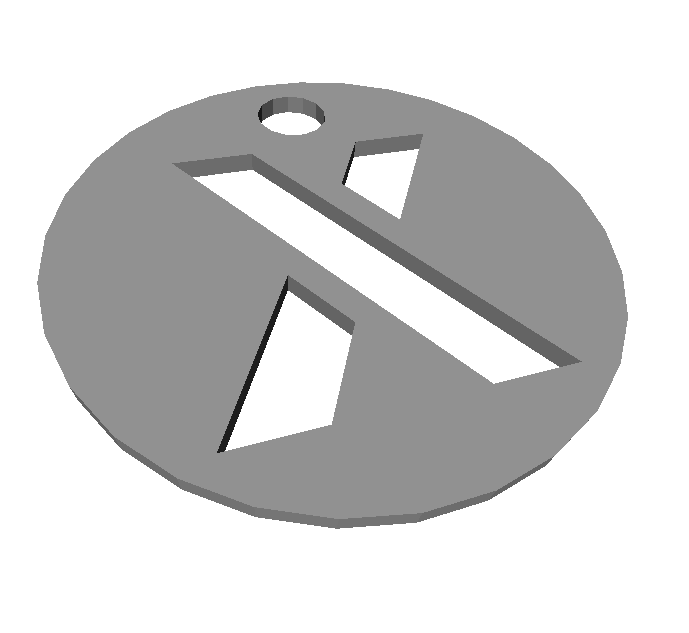

# 3D Model Generator
This project is about generating parametric 3D models. The generated files can be processed with a slicer and then sent to a 3D printer. 


## Tokens
Tokens can be used for example in shopping trolleys.




# Releases
You can download the latest package with stl files from the release section. If you want to build the files on your own or want to modify something, please read on.


# Prerequisites
A Linux Docker environment is required to run the 3d model generator


# Usage
Clone this repository and run:
```
sudo docker run -v /path/to/repo:/work gravity981/3dgen \
  -m models \
  -c config/example_token.json \
  -o output/example_token \
  --thumbnails \
  --poster
```

Have a look at [example_token.json](config/example_token.json) to see the possible parameters which can be configured. Change it according to your needs.

The output of the generator is one or more stl files. In order to 3d-print the tokens the stl files have to be processed with a slicer.


# Contribute
If you want to add a token have a look at [all_tokens.json](config/all_tokens.json). Open a PR to extend this json file with the config you want to add.
